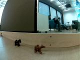
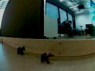

# Teaching a model car to drive

## About

This project is done as a part of the Machine Learning (MTAT.03.227) 2022 course. The goal of the project is to teach a model car ([Donkeycar](http://docs.donkeycar.com/)) to drive around a city like circuit so that it can:
- choose a driving direction based on a left/right arrow sign;
- avoid all the obstacles (pedestrians, animals etc) on the road;
- give way to an another car on the intersection;
- stop in front of a stop sign without hitting it.

The evaluation of the final model and comparison with the other teams will be made on 25th January 2023, when the model will participate in the [ADL Minicar Challenge](https://docs.google.com/document/d/1lKWmzDgB0UsW0jYLL02xssNvKfSIyu-uawcHl9se4VY/edit).

## Technical details

The following instructions can be used to collect data, train models and communicate with a car.

### Connecting to the car

SSH can be used to establish a connection with the car:

```
ssh pi@[car-ip]
```

### Collecting Data

Frames, that can be used to train a model later on, can be captured with following instruction:

```
python manage.py drive --js
```

The collected frames will be located in an automatically created tub folder inside the data folder.

### Transfering files

The Raspberry PI used by the Donkey car is not powerful enough to train a CNN model, which means that this must be done in a different environment. This means that the image files, used to train the model, must be retrieved from the car and then the created model must be sent back. Although it is possible to move files between the car and the computer with an SD card, we found it convenient to use scp instead.

Copying files from the car (tub file example)

```
scp -r pi@[car-ip]:/home/pi/[car-folder-name]/data/[tub-folder-name] /destination/path
```

Copying files to the car (trained model example)

```
scp [model-name].h5 pi@[car-ip]:/home/pi/[car-folder-name]/models
```

### Training a model 

Collected data can be used to train a model in the car folder with a statement:

```
donkey train -- tub ./data/* --model ./models/[model-name].h5
```

This statement will use all the tub files in the data folder.  
Hyperparameters like epoch, batch size etc can be changed in the config.py file that is located in the root car folder. Note that the donkeycar and mycar which are used for driving differ from the the training configuration.

### Training a model 
To training files for models like stop sign, arrow sign, crosswalk and right hand rule can be found in scripts folder.

### Testing the model

The created model can be used to control the car with a following instruction:

```
python manage.py drive --model_SD ./models/[mode-name].h5 --model_PK ./models/[mode-name].h5 --model_YK ./models/[mode-name].h5 --model_STOP ./models/[mode-name].h5 --model_ARROW ./models/[mode-name].h5
```

where model_SD stand for general self-driving model, model_PK stand for right hand rule model, model_YK stand for crosswalk model, model_STOP stand for stop sign model and model_ARROW stand for arrow sign model.

## Steps so far

We have collected over 100K frames so far with varying speeds, obstacle positions and lighting conditions. The images can be found in the [Google Drive](https://drive.google.com/drive/folders/1s1fuojH4sHv6buKUtdfz4J60KtZhVlmV) folder. The resolution of each image is 120x160. For arrow sign detection the images are collected at 720x960. This is due to the size of the sign. At lower resolution the direction of the sign is not detectable at the required distance. The rest of the models are kept at lower resolution due to the limited computational capabilities.

We have also used augmentation techniques in order to increase the amount of pictures. The first augmentation that we have used is changing the brightness of the images. The track is located near a big window, which means that every time the lighting conditions are a little bit different, so the brightness augmentation should make the model work better in different lighting conditions.  

Original image:  
  

Augmented image:  


## Running of the models
When program starts it initalizes camera at 720x960 resolution. Due to the track layout, we know that arrow sign is before others and first we run arrow sign detection and for self-driving model the images are resized to 120x160. As soon as arrow sign is detected we switch the camera's resolution to 120x160 and arrow sign model is no longer used. To keep computation minimal, then at each loop we run one complimentary model and self-driving model. This means at one frame we first run stop sign model and then self driving model (if stop sign model didn't require us to stop). Then at next step we run right hand rule model and then self-driving model. After that we run crosswalk model and then self-driving model and after that we start again from stop sign model. If let's say right hand rule detects the car on the right and we need to stop, then at the next frame we run right hand rule model again. The program moves on from right hand model when it detect no car.